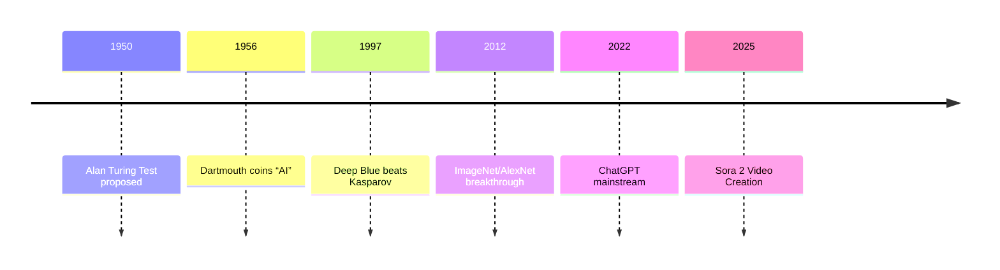
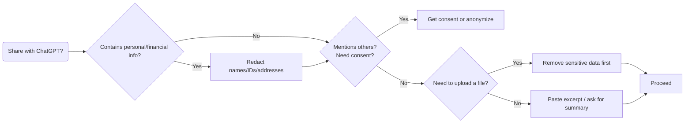
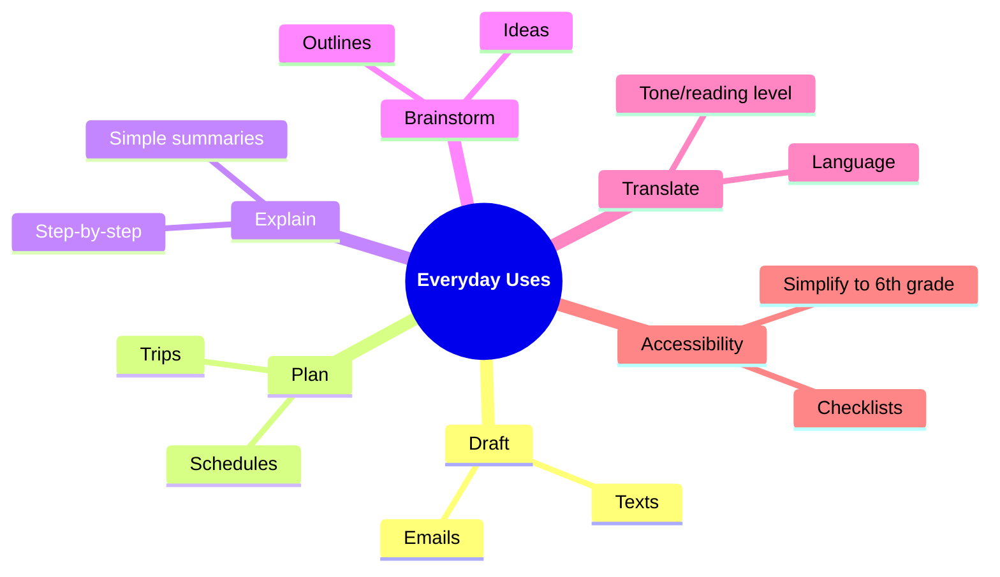
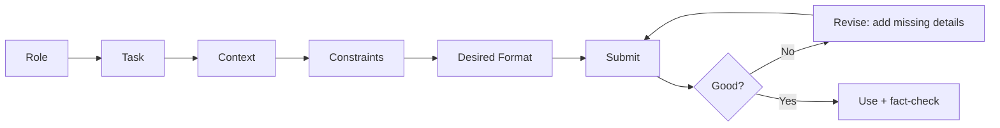

# Welcome

**Getting Started with AI**

### Presenter:

**Garth Tuck**

---
layout: image-right

image: /title-slide.png
---

# Workshop Goals:

- Understand what generative AI is and how it works  
- Explore real-world examples of how AI already impacts our lives  
- A few milestones in AI history and key AI vocabulary and concepts  
- Practice writing effective prompts to get useful responses from ChatGPT  
- Try hands-on tools and leave with ideas you can apply right away
- Have FUN!!!

---
layout: two-cols-header
---

# Agenda + Housekeeping

::left::

### Workshop Environment:
- Open, inclusive, and curiosity-driven

### Agenda
- Welcome and intros (5)
- What is AI? (10)
- Safety and privacy (5)
- Demos (15)
- Guided practice (20)
- Wrap and next steps (5)

::right::

### Housekeeping
- Wi‑Fi: [Liahona], Password: [alma3738]
- Pair up if you don’t have a device
- Raise your hand for help anytime
         

---
layout: quote
---

# AI in our world

**Where do you think AI might already be helping you in daily life—without you even realizing it?**

---

# A few examples include:

<v-clicks>

1. **📸 Photo Tagging & Face Recognition** Your phone or social media app automatically groups your photos by faces or places—powered by AI.

2. **🔍 Search Suggestions** As you type, search engines guess what you mean based on past searches and trends—thank AI for that.

3. **🧭 GPS & Maps** AI predicts traffic, suggests faster routes, and updates real-time arrival times.

4. **📺 Streaming Recommendations** Netflix, YouTube, Spotify, etc., use AI to suggest shows or songs based on what you've watched or listened to.

5. **📱 Voice Assistants** Siri, Alexa, and Google Assistant recognize speech, interpret commands, and even hold mini conversations.

6. **📝 Autocorrect & Smart Text Prediction** Your phone suggests the next word or fixes typos as you type—that’s AI anticipating your intent.

7. **🌡️ Smart Home Devices** Thermostats like Nest learn your preferences and adjust temperatures automatically to save energy.

</v-clicks>
---
layout: two-cols-header
---

# Common AI Vocabulary

::left::

<v-clicks>

- **AI (Artificial Intelligence)** A computer system that can perform tasks usually requiring human intelligence (like understanding language or recognizing images).

- **ML (Machine Learning)** A type of AI where computers learn from data and improve over time without being explicitly programmed.

- **GPT (Generative Pre-trained Transformer)** A large language model trained on tons of text to predict and generate human-like responses.

- **LLM (Large Language Model)** A type of AI trained on massive text data to understand and generate human language.

</v-clicks>

::right::

<v-clicks>

- **Token** A piece of a word or character that the AI processes; for example, “chatting” might be split into “chat” and “ting”.

- **Prompt** The input or question you give to an AI—what you type to start the conversation.

- **Training Data** The information (usually lots of text) used to teach the AI how to understand and respond.

- **Inference** The process of the AI generating a response based on your input—it’s “thinking” time for the model.

</v-clicks>

---

# Moments That Matter (AI)

<v-clicks>

- 1950 — Turing Test proposed (Can machines converse like humans?)
- 1956 — Dartmouth workshop coins “Artificial Intelligence”
- 1997 — Deep Blue defeats Garry Kasparov (chess milestone)
- 2012 — ImageNet/AlexNet sparks modern deep learning boom
- 2022 — ChatGPT goes mainstream
- 2025 - Sora 2 video creation

</v-clicks>

---
layout: two-cols-header
---

# More AI Milestones

::left::

<v-clicks>

- **2011 – IBM Watson Wins Jeopardy!** Defeats human champions with deep NLP and fact retrieval.

- **2012 – ImageNet & AlexNet Breakthrough** Deep learning revolution begins with CNNs and visual recognition success.

- **2016 – AlphaGo Beats Lee Sedol** Reinforcement learning and self-play reach new levels of strategy.

- **2020 – GPT-3 Released by OpenAI** Natural language generation reaches astonishing fluency and scale.

</v-clicks>

::right::

<v-clicks>

- **2022 – ChatGPT Goes Mainstream** Conversational AI enters daily use with GPT-powered assistants.

- **2023 – AI-Generated Art and Code Boom** Tools like DALL·E, Copilot, and Midjourney reshape creative and coding work.

- **2024 – GPT-4 Multimodal Release** First major model to understand and generate both text and images with precision.

- **2025 – Sora 2 Release** Model for generating highly realistic, physics-accurate video clips with audio.

</v-clicks>
 
 
 

---
layout: two-cols-header
---

# What ChatGPT Is and Isn’t

::left::

<v-clicks>

## What it’s good at

</v-clicks>

<v-clicks>

- **Drafting and rewriting** → Generates first drafts, refines text, and adapts tone or style.

- **Summarizing and outlining** → Condenses long materials into key points or structured outlines.

- **Brainstorming ideas** → Sparks creativity for names, titles, lessons, or storylines.

- **Explaining concepts** → Breaks down complex topics in plain language or step-by-step guides.

- **Tutoring and learning aid** → Provides examples, explanations, and feedback for study or practice.

</v-clicks>

::right::

<v-clicks>

## Limits and cautions

</v-clicks>

<v-clicks>

- **Can be wrong (“hallucinations”)** → May sound confident but provide incorrect information; always verify.

- **Not medical, legal, or financial advice** → Use for learning, not for professional decision-making.

- **May be out of date** → Some models don’t have live data; ask for sources or updates.

- **Privacy matters** → Don’t share personal, confidential, or proprietary information.

- **Biases exist** → Reflects training data patterns; double-check for fairness or accuracy.

</v-clicks>

---

# Privacy & Safety Basics

<v-clicks>

- Don’t paste private or financial information
- Remove names/IDs before sharing content
- Get consent before using others’ info or photos
- Ask for summaries without uploading files when possible

</v-clicks>

 
 

<v-clicks>

</v-clicks>

---

# A few common ways AI is used today

<v-clicks>

- 💬 **Conversational Assistants:**  
  Chatbots like ChatGPT, Google Assistant, and Siri help answer questions and automate everyday tasks.

- 🎨 **Image and Art Generation:**  
  Tools such as DALL·E and Midjourney can create unique images from simple text prompts.

- 📈 **Business Productivity:**  
  Automate emails, summarize meetings, write reports, and generate marketing content.

- 🧠 **Education & Tutoring:**  
  Personalized explanations, homework help, and support for language learning.

- 🎙️ **Realistic Voice Companions:**  
  Platforms such as Sesame feature expressive AI voices for lifelike conversation.

- 🎥 **Ultra-Realistic AI Video Creation (New!):**  
  Sora 2 by OpenAI lets you turn text prompts into cinematic videos, animate people or pets, and add music or sound effects.  

</v-clicks>

---
layout: center
---

# <a href="https://app.sesame.com/" target="_blank">Conversational voice demo</a>

---
layout: center
---

# <a href="https://sora.chatgpt.com/explore" target="_blank">Video creation demo</a>
---
layout: center
---

# <a href="https://chatgpt.com" target="_blank">ChatGPT demo</a>

---

# A few practical ways to use ChatGPT

<v-clicks>

1. 📝 **Draft Emails or Messages**  
   Quickly write polite, professional, or friendly emails and texts.

2. 📅 **Plan Your Day or Week**  
   Ask for a customized daily schedule based on your tasks and preferences.

3. 🍽️ **Meal Planning and Recipes**  
   Get meal ideas based on ingredients you have or dietary needs.

4. 📚 **Explain Complex Topics Simply**  
   Ask for an easy-to-understand explanation of concepts like credit scores or climate change.

5. 🛠️ **Brainstorm Ideas**  
   Generate creative ideas for gifts, events, projects, or side hustles.

6. 🌍 **Translate and Adapt**  
   Translate messages and adjust tone/reading level for your audience.

7. ♿ **Accessibility Helpers**  
   Simplify to a 6th‑grade reading level or generate step‑by‑step checklists.

</v-clicks>

---

---

# How to write a good prompt

<v-clicks>

</v-clicks>

<v-clicks>

- 🧩 **Be specific**  
  "Tell me a bedtime story about a robot and a cat" vs. "Write a story"
- 🗣️ **Use natural language**  
  Pretend you're talking to a helpful friend, not coding a machine.
- 🎨 **Set the tone**  
  Want it funny? Professional? Thoughtful? Just say so!
- 💡 **Give examples**  
  "Make it sound like a Shakespearean poem" or "List it like a recipe."
- 🔁 **Tweak and test**  
  If the first response isn't great, try rewording or asking from a new angle!

 </v-clicks>

---

# For example:

 

## ❌ Poor Prompt

"Write something about dogs."
 

## ✅ Good Prompt

"Write a friendly and informative 3-paragraph article for a blog about the benefits of owning a dog, focusing on companionship, exercise, and mental health."

---

# Prompt Ideas You Can Try Right Now

<v-clicks>

1. ✉️ Write a polite message to reschedule my dentist appointment.

2. 🧑‍🍳 Give me a 3-day healthy meal plan with simple recipes.

3. 🧠 Explain how interest rates work like I’m in 9th grade.

4. 🧳 Suggest a weekend getaway near [a city] under $300.

5. 🎁 What’s a fun birthday gift idea for a 12-year-old who loves space?

6. 🐶 Write a funny haiku about a dog who’s afraid of squirrels.

</v-clicks>

---
layout: two-cols-header
---

# Group Activity - Try ChatGPT yourself!

::left::

- **<u>Timebox: 10 minutes</u>**
- On your phone or a shared device:
  - Scan the QR code to open chatgpt.com →
- **<u>Enter your prompt:</u>**
  - Example: Plan a 3-day Southern Utah road trip with kids (ages, 12, 9. 6).
  - Now, try changing the destination or group type.
- No smartphone? Pair with a neighbor.
- Share your results with the group (2–3 volunteers)

::right::

 
 
 

---

# Questions?

---
layout: image-left

image: end-slide.png
---

# Happy trails!

👋🏻 Thanks for your time.

💡 Want more? Visit <a href="https://chatgpt.com" target="_blank">chatgpt.com</a> or scan the QR code again anytime.

